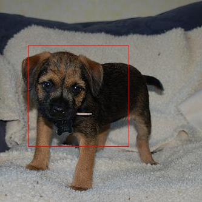
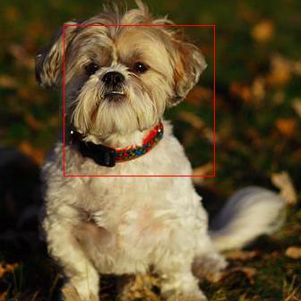
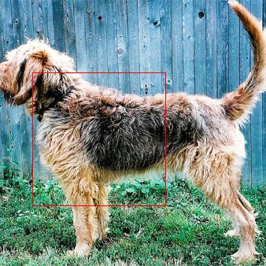
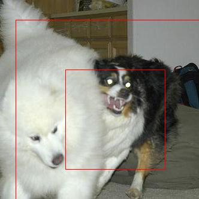
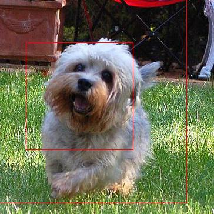
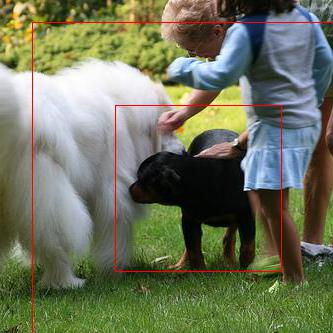

# Visual-Attention-Pytorch
Implementation of [Attention for Fine-Grained Categorization](https://arxiv.org/abs/1412.7054) paper with minor modifications in Pytorch

## Model Description
* In the mentioned paper, they use two rnns, one for classification task (rnn1) and the other for predicting the glimpse location (rnn2). In this model, the task of predicting glimpse location is done by using soft attention over context image. Specifically, at each time step, I divided the context image into 4 regions (top left, top right, bottom left and bottom right) and used spatial attention model mentioned in [Knowing When to Look](https://arxiv.org/abs/1612.01887). Replacing rnn2 with soft attention led to faster training and computation with less memory. Also, I used LSTM instead of simple rnn for classification task
* In the paper, they combine information of location and features of a glimpse before feeding to rnn1. Instead, I just used feature information as it is found to increase the stability of the training. Mixing of location and features information might work for datasets like mnist as shape of objects are fixed. But not for natural images as they have high variance in pose of objects
* Soft attention is used from time_step=1 using lstm hidden state. For time_step=0, lstm hidden state doesn't have any impact. So, soft attention for time_step=0 is performed using 1x1 convolution which maps each regional feature vector of 2048 dimensions to 1 dimension. Later, softmax is performed to obtain probabilities over the regions
* In this model, I used resnet50 as visual network pretrained on imagenet and further trained on Stanford dogs dataset  

### Hyper parameters k and start_size:
k = [1,2,3] refers to the number of patches to extract given a location tuple. start_size refers at what size we have to start extracting. start_size = 1, 2, 4 for high resolution, medium resolution and low resolution respectively
For example, 
* k = 1 and start_size = 1: Extract only high resolution patch
* k = 2 and start_size = 2: Extract medium resolution and low resolution path
* k = 3 and start_size = 1: Extract high, medium and low resolution patches

## Prerequisites
* Python 2.7
* Pytorch 0.4.0
* Torchvision 0.2.1
* joblib
* ImageDraw

## Data
Download Stanford dogs dataset from http://vision.stanford.edu/aditya86/ImageNetDogs/ and copy ```Original``` folder to ```data``` folder in the repository

## Running on GPUs
Enabled running on multiple GPUs. Edit cuda device numbers in ```main.py``` and ```pretrain.py```

## Pre-training
To pretrain visual network, run:
```
python pretrain.py
```
You can find my pretrained resnet model at ```data/saved_models```. You can rename it to ```pt_glimpse_model.tar``` and can direcly skip to main training

## Training
To train the model from beginning, run:
```
python main.py
```
To resume training from a saved model, run:
```
python main.py --resume_training=True
```
## Testing
To find the accuracy achieved by the model on test set, run:
```
python main.py --task=test
```
To analyze the model by drawing bounding boxes on images and knowing where the model is focusing, run:
```
python main.py --task=view_glimpses
```
You can find the generated images in ```imgs``` folder

## Examples
### k=1 and start_size=2; final_accuracy=73.1:
  
### k=2 and start_size=2; final_accuracy=76.2:
  


